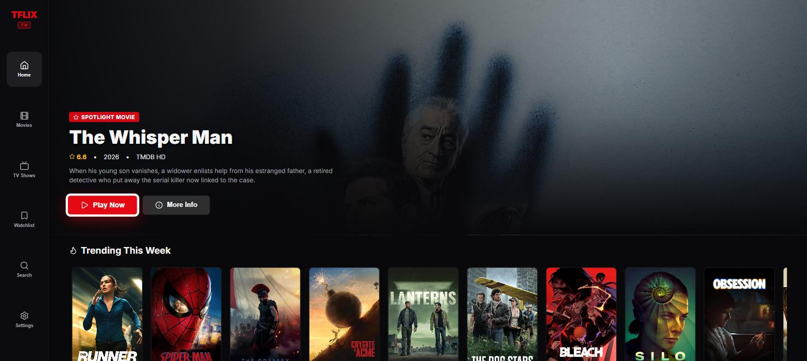
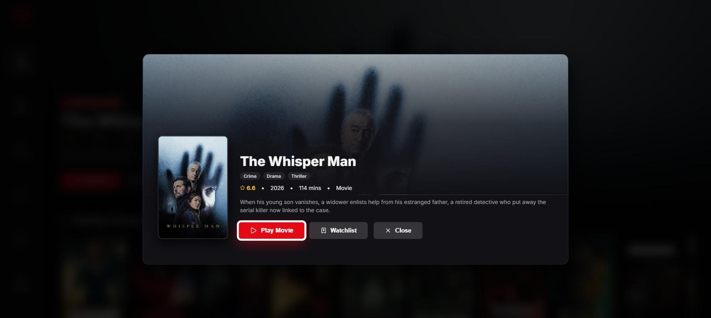
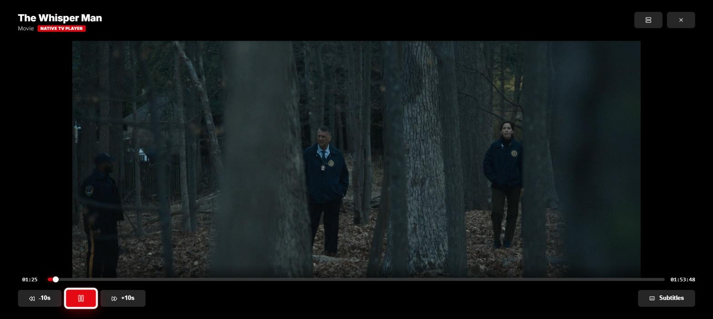
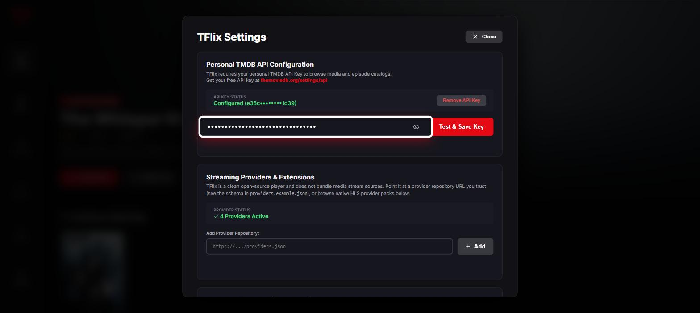
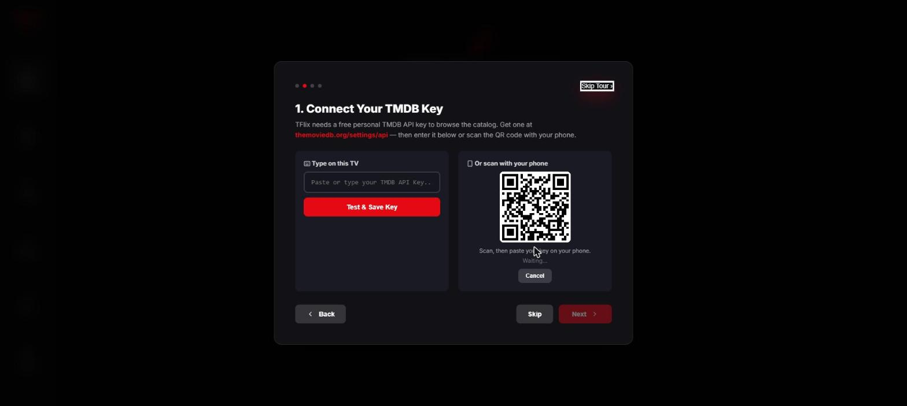
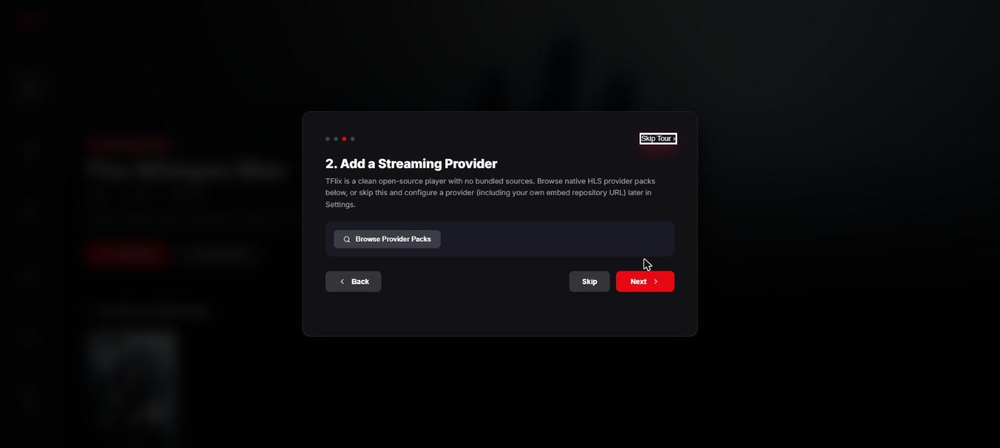

<div align="center">

# 📺 TFlix

**A standalone streaming app for Samsung Smart TVs, built for [TizenBrew](https://github.com/reisxd/TizenBrew).**
Browse and watch from your own TMDB catalog, play from whatever streaming providers you choose to install — full D-pad navigation, no mouse or touch required.

[](https://www.npmjs.com/package/@zyrecx/tflix)
[](./LICENSE)

[Get Started](#get-started) · [Provider Packs](#create-your-own-provider-pack) · [Report an Issue](https://github.com/Zyrecx/TFlix/issues)

</div>

> **Note:** The original TFlix was a TizenBrew mod that wrapped [Cineby.at](https://www.cineby.at). That codebase is archived on the [`v1-legacy`](https://github.com/Zyrecx/TFlix/tree/v1-legacy) branch and is no longer maintained — `main` is the current, standalone app described below.

---

## Screenshots

<table>
<tr>
<td width="50%"></td>
<td width="50%"></td>
</tr>
<tr>
<td width="50%"></td>
<td width="50%"></td>
</tr>
</table>

---

## Features

- **Rich TMDB Catalog & Discovery** — Trending movies, popular series, genres, top-rated titles, and full cast/season/episode info.
- **Full Remote Control** — Navigate the entire app with your TV remote's D-pad.
- **Hybrid Playback Engine** — Native `Hls.js` + HTML5 video for direct sources, iframe-embed fallback for others, both with full transport controls (play/pause, skip, scrub, subtitle/audio tracks, resume, auto-next-episode).
- **Bring Your Own TMDB Key** — Free personal TMDB API key stored locally on the TV; no shared rate limits.
- **Watch History & Watchlist** — Local resume timestamps and a saved watchlist, stored entirely on-device.
- **Guided First-Run Setup** — A short setup tour walks new users through connecting a TMDB key and a streaming provider, including a QR-code phone-pairing flow so you don't have to type a key with a TV remote.
- **No Bundled Streaming Sources** — TFlix ships as a clean player with zero built-in scrapers. Streaming providers are loaded at runtime from a pack you choose — see [Streaming Providers](#streaming-providers) below.

---

## Get Started

### 1. Install TizenBrew

TFlix runs as a module inside [**TizenBrew**](https://github.com/reisxd/TizenBrew), a way to sideload apps onto Samsung Smart TVs without fighting Tizen Studio. If you don't have it yet, follow TizenBrew's own install guide for your TV first — TFlix can't run without it.

### 2. Install TFlix

1. Open **TizenBrew** on your Samsung TV.
2. Choose to install a module from npm and enter the package name: `@zyrecx/tflix`.
3. Confirm the install, then launch TFlix from your TizenBrew modules menu.

### 3. Get a free TMDB API key

TFlix pulls its whole catalog (trending, search, cast, artwork) from [**TMDB**](https://www.themoviedb.org/), using a key you request yourself — free, and not shared with other users.

1. Create a TMDB account, then generate an API key at [themoviedb.org/settings/api](https://www.themoviedb.org/settings/api).
2. On first launch, TFlix's setup tour will ask for this key. You can type it with the remote, or scan the on-screen QR code to paste it in from your phone instead.



### 4. Add a streaming provider

TFlix comes with one direct HLS provider set up out of the box (served from a Cloudflare Worker, kept out of this repo/npm package to avoid takedowns), plus support for adding your own embed providers. See [Streaming Providers](#streaming-providers) below for how that works, and `Settings → Streaming Providers` in-app to add more.



---

## Streaming Providers

TFlix doesn't host or bundle any streaming sources in this repo or the npm package — it's a player, not a source. Instead:

- **Embed providers** (iframe-based) can be loaded from a community JSON list or your own, via `Settings → Streaming Providers`. See [`providers.example.json`](./providers.example.json) for the schema.
- **Direct HLS providers** (native `Hls.js` playback) come from installable **provider packs** — small plugin bundles fetched at runtime, either by browsing a catalog or scanning a pairing QR code, both in `Settings → Add a Provider Pack`. This keeps any source-specific extraction code out of this repo entirely, and lets a pack be pulled independently if its source ever needs to come down.

### Create your own provider pack

Want to create a provider from a source? [`docs/PROVIDER_PACKS.md`](./docs/PROVIDER_PACKS.md) documents the full provider pack format with a working example — everything you need to build and share your own pack.

---

## Local Development & Testing (No TV Required)

You can run and test the complete TV experience in Google Chrome or Microsoft Edge on your desktop:

```bash
# 1. Install dependencies
npm install

# 2. Start local development server
npm run dev
```

Open `http://localhost:5173` in your browser. A floating **TV Remote Simulator** will appear on the bottom-right of your screen, allowing you to test D-Pad navigation, media controls, and TMDB features using your keyboard or mouse.

See [dev/README.md](dev/README.md) for full desktop testing documentation, and [LOCAL-TESTING.md](LOCAL-TESTING.md) for the local relay/service testing notes.

---

## Building for Production

To build the optimized static distribution package for TizenBrew:

```bash
npm run build
```

This compiles the app into the `dist/` directory, ready to be packaged by TizenBrew (`packageType: "app"`).

---

## TV Remote Key Controls

| Remote Button | Desktop Key | Action |
| :--- | :--- | :--- |
| **D-Pad Up / Down** | `ArrowUp` / `ArrowDown` | Navigate rows, buttons, and HUD controls |
| **D-Pad Left / Right** | `ArrowLeft` / `ArrowRight` | Navigate carousel / On the seek bar: move a pending ±10s position (preview, not yet applied) |
| **OK / Enter** | `Enter` | Select button / Toggle Play & Pause / On the seek bar: commit the pending seek position |
| **Back / Return (`10009`)** | `Escape` / `b` | Exit player / Close modal / Return to Home |
| **Play / Pause (`MediaPlayPause`)** | `Space` / `p` | Toggle stream playback (Native & Embed) |
| **Fast Forward (`417`)** | `f` | Jump forward +10 seconds |
| **Rewind (`412`)** | `r` | Jump backward -10 seconds |
| **Next Track (`MediaTrackNext`)** | `n` | Jump to Next TV Episode immediately |
| **Stop (`MediaStop`)** | `s` | Stop playback and close player |

---

## Contributing & Feedback

Found a bug, or have an idea for a feature? [Open an issue](https://github.com/Zyrecx/TFlix/issues) — bug reports and suggestions are both welcome.

Pull requests are welcome too. For anything non-trivial, opening an issue first to discuss the change is appreciated but not required.

---

## Disclaimer

TFlix is a player. It has no affiliation with, and does not host, index, or distribute any media content or streaming source — all content is fetched from third-party providers that users choose to add themselves.

---

## License

MIT
